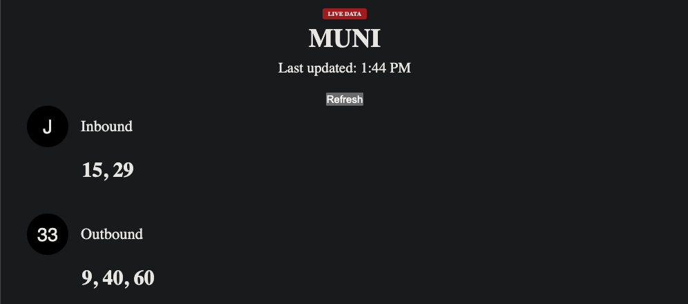

# SF Bay Real-Time Transit Dashboard (Web App)
<p align="center"> 
     
</p>

<!-- [](https://htmlpreview.github.io/?https://github.com/nathantorento/bay-transit-dashboard/blob/main/dashboard.html) -->

## Overview
A lightweight, browser-based dashboard that displays real-time MUNI arrival times using data from the 511.org
 API. The app is designed to be large-text, high-contrast, and e-ink-friendly, while still supporting live countdowns and manual refreshes.

This project started as a Python script that generated a static dashboard.html file. It has since evolved into a small JavaScript web app with live vs debugging mode to not max out API token limit and is optimized for a tablet or small screen set-up.

> <b>Stack</b>: Vanilla JavaScript • HTML/CSS • 511.org API • JSON • Browser APIs

## Why I Built This

My partner and I ride MUNI buses and trains daily and wanted a screen at home that shows J-Church and 33-Ashbury arrivals at a glance, without pulling out our phones. We wanted something simple, readable, and always on.

This project solves that problem while also serving as a practical demo of frontend engineering, API integration, defensive parsing, and UX decisions around rate limits and real-time data.

## Skills Demonstrated
### API + Data
REST API integration (511.org StopMonitoring)
Defensive schema validation
Time math and UTC → local countdowns
Rate-limit–aware design (manual refresh + cooldown)
Parallel requests with Promise.all

### Frontend Engineering
Vanilla JS DOM rendering (no frameworks)
Separation of concerns: fetch → validate → parse → render
Real-time UI updates without refetching
Clean, accessible HTML/CSS
State management without libraries

### Support / DevEx Skills
Clear failure modes for API changes
Explicit error handling for auth and quota issues
Fake vs live data modes for safe debugging
Readable, maintainable code paths
Easy-to-extend architecture for future backend migration

## High-Level Architecture
```
511 API
   ↓
fetchApiJSON()        → network + HTTP handling
validateSchema()     → fail-fast API contract checks
parseApiJSON()       → normalize into render-ready objects
renderEntries()      → DOM updates
UI tick (1s)         → live countdown without refetch
Auto refresh (60s)   → live data refresh
Manual refresh       → button + cooldown

Data Model
{
  line: "J",
  destination: "Inbound",
  arrivals: [Date, Date, Date]
}
```

## Features
- Live arrival countdowns (updates every second)
- Manual refresh button with 30-second cooldown
- Automatic refresh every 60 seconds (live mode)
- Fake data mode for development and demos
- Empty-state handling when no arrivals are coming soon
- Large-text, high-contrast UI suitable for e-ink displays

## Setup
#### 1. Clone the repo
git clone https://github.com/nathantorento/bay-transit-dashboard-web
cd bay-transit-dashboard-web

#### 2. Get a 511 API token

Request a free token from:
https://511.org/open-data/token

#### 3. Configure live vs fake mode

In script.js:

const USE_LIVE_API = true; // set false to use fake data
const API_KEY = "your-511-api-key"; // local testing only

⚠️ Do not deploy your API key publicly.
The next step for this project is moving API calls to a Vercel backend.

#### 4. Open the app

Just open index.html in your browser.

No build step required.
